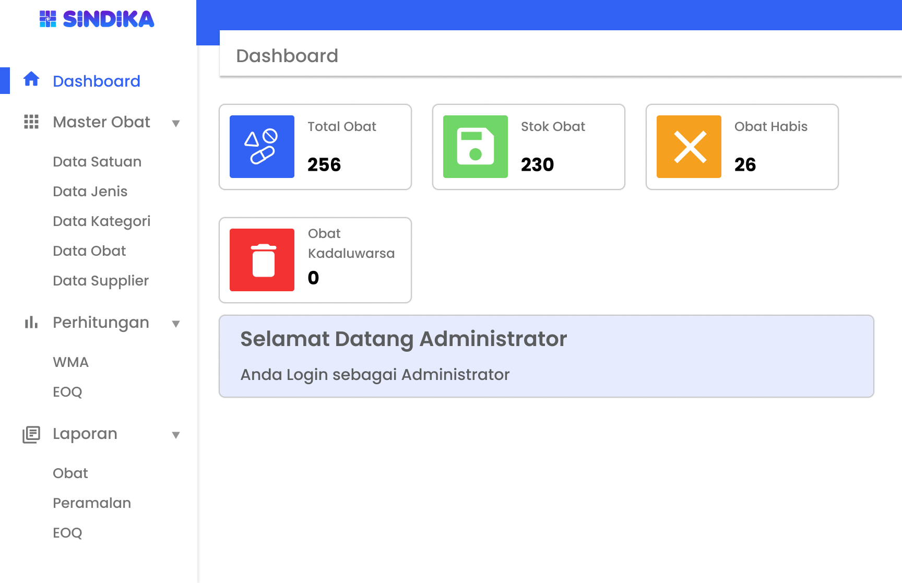
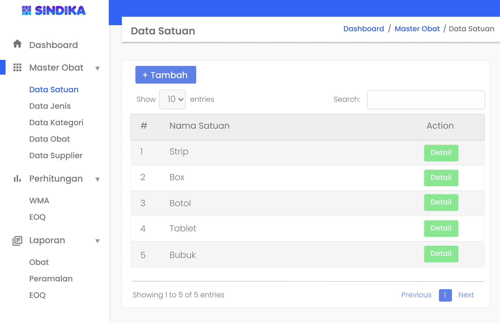
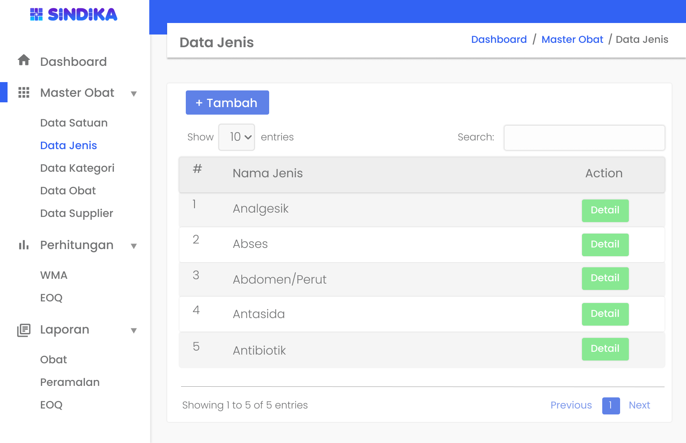
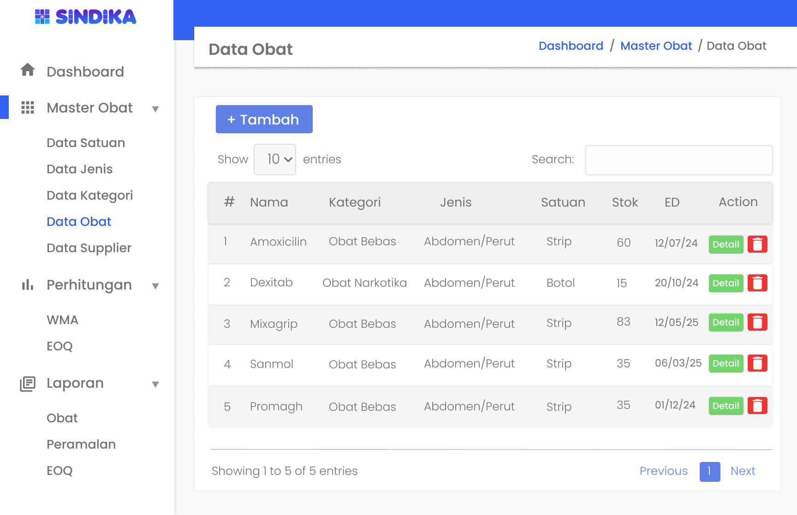
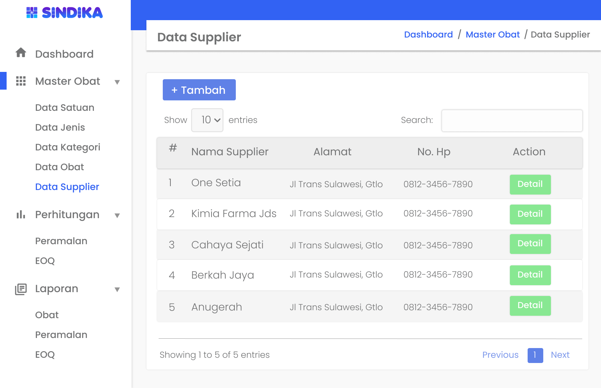
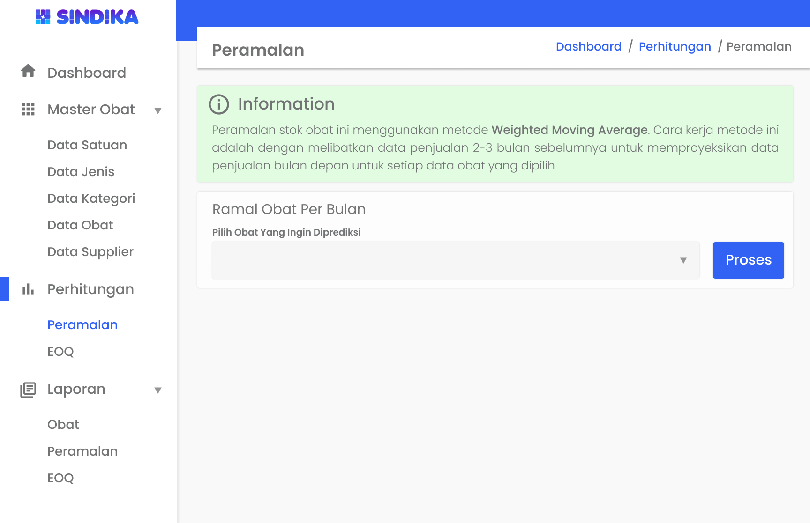
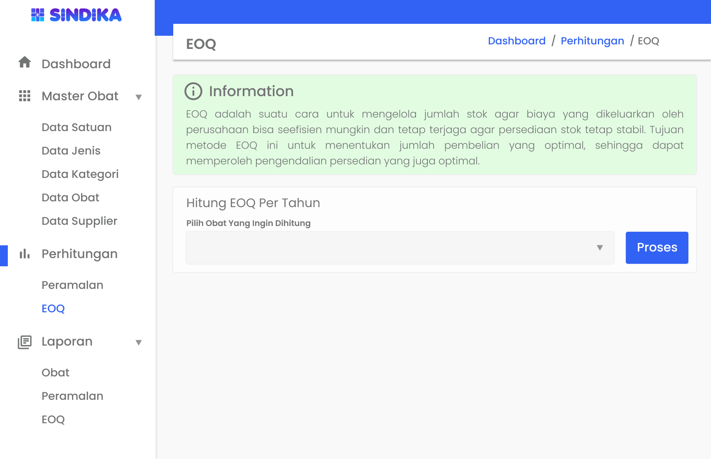

# User Interface

1. [x] **Login**
       
2. [x] **Dashboard**
       
3. [x] **Data Satuan**
       
4. [ ] **Data Jenis**
       
5. [ ] **Data Kategori**
       
6. [ ] **Data Obat**
       
7. [ ] **Data Supplier**
       
8. [ ] **WMA**
       
9. [ ] **EOQ**
       
